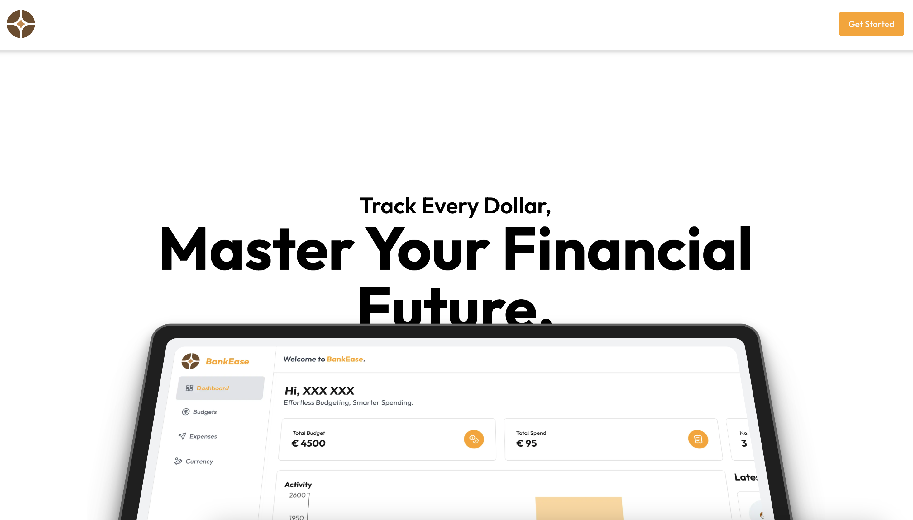
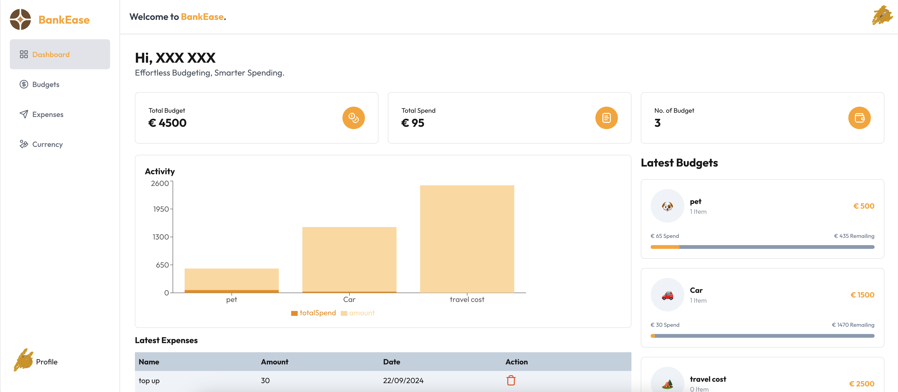
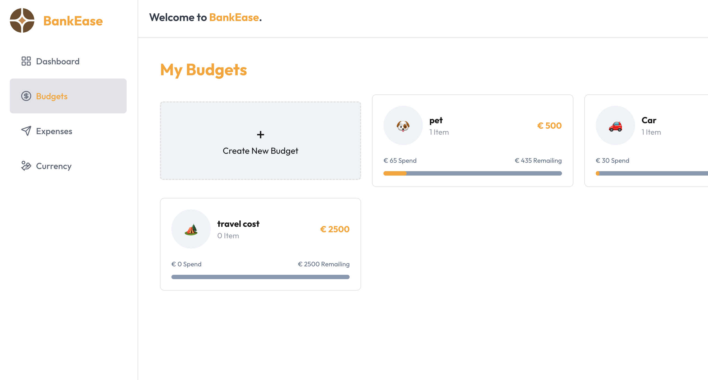
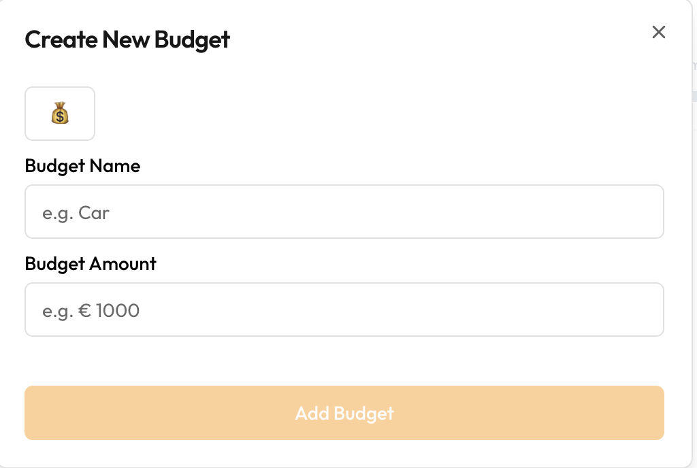
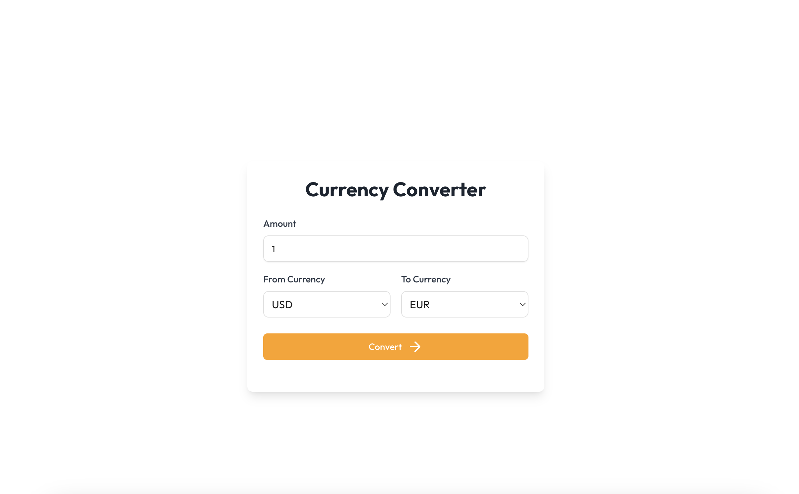
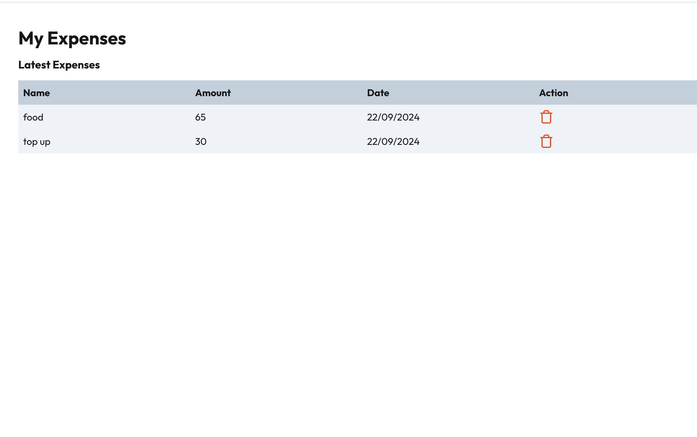

# BankEase 💰

BankEase is a modern budgeting and expense tracking application that helps users manage their finances effortlessly. With BankEase, users can create budgets, track expenses, and get real-time insights into their spending habits. Additionally, the app provides a currency conversion feature for users dealing with multiple currencies.



## Deploy on Vercel

This project is deployed on Vercel. You can access the live version of the app here: [BankEase](https://bankease.vercel.app/)


## Features

- Create and manage budgets.
- Track expenses against each budget.
- View spending insights through charts and analytics.
- Currency conversion between multiple currencies.
- User authentication and secure sign-in using Clerk.
- Responsive design for both mobile and desktop.

## Technologies Used

This project is built using the following technologies:

- **Next.js**: A React framework for building fast and scalable web applications.
- **Tailwind CSS**: A utility-first CSS framework for styling the app.
- **Drizzle ORM**: A lightweight TypeScript ORM for managing database schema and queries.
- **PostgreSQL**: A powerful, open-source relational database system used to store data.
- **Clerk**: For user authentication, registration, and profile management.
- **Sonner**: For toast notifications across the app.
- **Neon**: A serverless PostgreSQL hosting platform.
- **ExchangeRate-API**: Used for fetching real-time currency conversion rates.
- **Chart.js**: For creating interactive data visualizations in the dashboard.
  
## Installation & Setup

1. Clone the repository:
   ```bash
   git clone https://github.com/username/bankease.git

2. Install the dependencies::
   ```bash
    npm install

3. Set up environment variables. Create a .env.local file in the root directory with the following:
   ```bash
    NEXT_PUBLIC_DATABASE_URL=<Your PostgreSQL URL>
    CLERK_FRONTEND_API=<Your Clerk Frontend API>
    CLERK_API_KEY=<Your Clerk API Key>
    EXCHANGE_RATE_API_KEY=<Your Exchange Rate API Key>


4. Run the development server:
   ```bash
    npm run dev

The app will be available at http://localhost:3000.


## Screenshots








